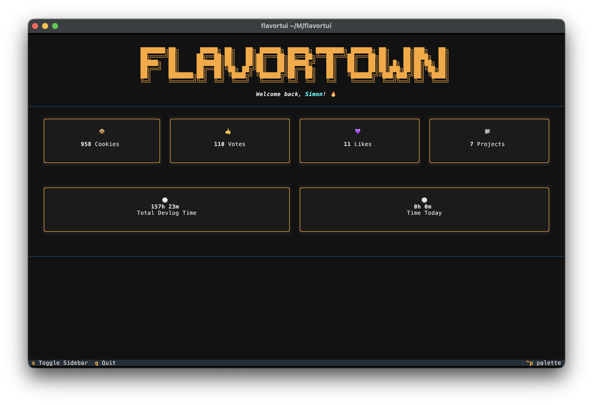
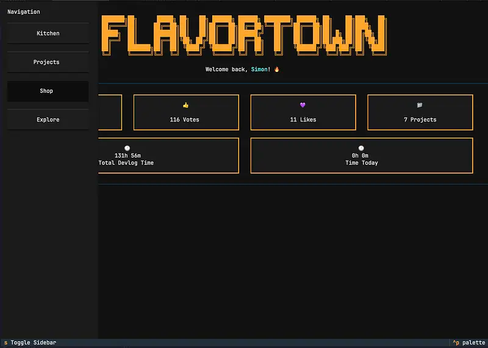

# FlavorTUI

[](https://pypi.org/project/flavortui)
[](https://pypi.org/project/flavortui)

FlavorTUI is a feature-rich terminal user interface (TUI) for Flavortown. With FlavorTUI, you can browse and create devlogs, manage your projects, explore the shop, and access other Flavortown features, all from an interactive terminal interface.

It is built using the `textual` library, which provides (imo) a great terminal UI experience. The TUI is of course written in Python 🥰. This is my first time creating a TUI so I hope its good :) Depending on your terminal, the ui might look different. It all depends on how well your terminal supports different things.

Your API key is stored "securely" using the `keyring` library, so you don't have to worry about it being exposed in your terminal history or config files.

Additionaly, your settings are store using the `platformdirs` `user_config_dir` function. Your settings are probobly stored in `~/Library/Application Support/flavortui` on macOS, `C:\Users\<user>\AppData\Local\flavortui` on Windows (`%localappdata%`), and ~/.config/flavortui (or $XDG_CONFIG_HOME) on Linux.

<div>
  
  
</div>

## Installation

```bash
pip install flavortui
```

## Local Development

```bash
python -m venv venv
source venv/bin/activate  # On Windows: venv\Scripts\activate
pip install -e .
```

Run with either:

```bash
flavortui
```

or:

```bash
python -m flavortui
```

## API

Flavortown API docs can be found [here](https://flavortown.hackclub.com/api/v1/docs).

## License

`flavortui` is distributed under the terms of the MIT license.
